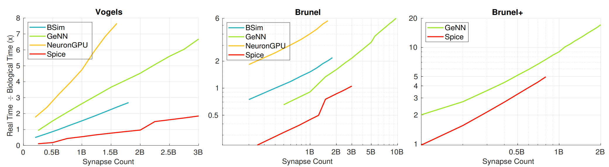
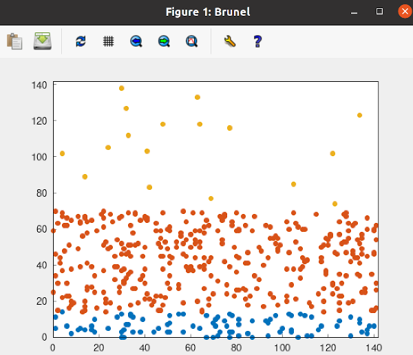

<small>[Photo](https://pixabay.com/photos/spices-spoons-salt-pepper-1914130/) by Daria Yakovleva</small>

# Spice

Spice (/spaɪk/) is a state of the art spiking neural network (SNN) simulator. It features:

- User-defined models
- High performance
- CPU and GPU backend
- Multi-GPU support
- Simple, intuitive API written in C++20


<small>Spice compared with 3 other state of the art simulators on 3 popular SNN models.</small>

Here is a simple SNN implemented in Spice to give you a taste of its API (`#include`'s etc. omitted for brevity):

```c++
struct poisson {
  bool update(float dt, auto& rng) const {
    return util::generate_canonical<float>(rng) < (20 * dt);
  }
};

struct lif {
  struct neuron {
    float V  = 0;
    int Tref = 0;
  };

  bool update(neuron& n, float dt, auto) const {
    if (--n.Tref <= 0) {
      if (n.V > 0.02) {
        n.V     = 0;
        n.Tref = 20;
        return true;
      }
      n.V -= n.V * dt * 50;
    }
    return false;
  }
};

struct fixed_weight {
  float weight;
  void deliver(lif::neuron& to) const { to.V += weight; }
};

int main() {
  int const N       = 20000;
  float const dt    = 1e-4;
  float const delay = 15e-4;

  snn brunel(dt, delay, {1337});
  auto P = brunel.add_population<poisson>(N / 2);
  auto E = brunel.add_population<lif>(N * 4 / 10);
  auto I = brunel.add_population<lif>(N / 10);

  brunel.connect<fixed_weight>(P, E, fixed_probability(0.1), delay, {2.0 / N});
  brunel.connect<fixed_weight>(P, I, fixed_probability(0.1), delay, {2.0 / N});
  brunel.connect<fixed_weight>(E, E, fixed_probability(0.1), delay, {2.0 / N});
  brunel.connect<fixed_weight>(E, I, fixed_probability(0.1), delay, {2.0 / N});
  brunel.connect<fixed_weight>(I, E, fixed_probability(0.1), delay, {-10.0 / N});
  brunel.connect<fixed_weight>(I, I, fixed_probability(0.1), delay, {-10.0 / N});

  for (int i = 0; i < 300; i++) {
    brunel.step();
		
    for (auto spike : brunel.spikes(0))
      printf("%d ", spike);
		
    printf("\n");
  }
}
```

## Requirements
- C++20 compiler (GCC 10+ &#10004; Clang 10+ <strong>?</strong> MSVC 17+ &#x2717;)
- CMake 3.12+
- [gnuplot](http://www.gnuplot.info/) (optional, for visualizing SNN activity inside the samples)

## Build
### Build Spice for the purpose of trying it out, hacking the samples...
#### Using the command line
```bash
git clone https://github.com/denniskb/spice2.git
cd spice2
git submodule update --init --recursive
mkdir build
cd build
cmake -DCMAKE_BUILD_TYPE=Release ..
make -j 8
```

<small>(Please note: The files `configure.sh` and `build.sh` are used by vscode tasks and should not be invoked directly.)</small>

To verify that everything worked you can run one of the samples. Still inside the `build` folder do:

```bash
./samples/brunel
```

which should print the SNN's firing pattern as JSON-formatted output to the terminal:

```
{
  "name": "Brunel",
  "spikes": [
    [10533,11015,11209,...],
    [10310,11115,11884,...],
    ...
  ]
}
```

If you'd like the samples to produce visual instead of text-based output, you should turn on the `spice_use_matplot` option, either by ticking the box inside cmake-gui, or via the command line (still inside `build`):

```bash
cmake -Dspice_use_matplot=ON ..
make -j 8
```

You'll also need to install [gnuplot](http://www.gnuplot.info/), on Linux via:

```bash
sudo apt install gnuplot
```

If you re-run brunel now you should see an animation similar to:



#### Using vscode
Spice comes with a bunch of pre-defined vscode tasks to simplify building it and running samples/tests/benchmarks...

```bash
git clone https://github.com/denniskb/spice2.git
cd spice2
git submodule update --init --recursive
```

<kbd>F1</kbd>&rarr;Tasks: Run Build Task&rarr;Configure&rarr;user \*

<kbd>F1</kbd>&rarr;Tasks: Run Build Task&rarr;Build&rarr;release \*\*

<small>\* only has to be run once</small>

<small>\*\* has to be run every time you want to build, is invoked automatically when you try to run samples/tests/benchmarks after having made changes to the code</small>

In order to run a sample:

<kbd>F1</kbd>&rarr;Tasks: Run Test Task&rarr;Samples&rarr;*type the name of the sample*

### Build Spice to use it inside your own project
If you want to use Spice as a library inside your own project, by far the simplest way is to add the Spice repository as a submodule to your repository and then add it to your `CMakeLists.txt` via `add_subdirectory()`, after which you'll be able to link against the `spice` target.

## Documentation

For a thorough guide on how to use Spice, including samples, tutorials, and an API reference, please consult the [wiki](https://github.com/denniskb/spice2/wiki).

## <a name="pubs"></a>Publications
In reverse chronological order:

- [Simulating Spiking Neural Networks on Multiple GPUs - When a Microsecond is an Eternity](https://bautembach.de/#phd) (Unpublished PhD thesis)
- [Even Faster SNN Simulation with Lazy Event-driven Plasticity and Shared Atomics](https://bautembach.de/#hpec2021) (HPEC 2021)
- [Multi-GPU SNN Simulation with Static Load Balancing](https://bautembach.de/#ijcnn2021) (IJCNN 2021)
- [Faster and Simpler SNN Simulation with Work Queues](https://bautembach.de/#ijcnn2020) (IJCNN 2020)

## Info for Contributors
### Build
Developers will additionally want to turn on the `spice_build_tests` and `spice_build_benchmarks` options inside cmake:

```bash
git clone https://github.com/denniskb/spice2.git
cd spice2
git submodule update --init --recursive
mkdir build
cd build
cmake -DCMAKE_BUILD_TYPE=Release -Dspice_build_tests=ON -Dspice_build_benchmarks=ON ..
make -j 8
```

Or, using vscode instead:

```bash
git clone https://github.com/denniskb/spice2.git
cd spice2
git submodule update --init --recursive
```

followed by:

<kbd>F1</kbd>&rarr;Tasks: Run Build Task&rarr;Configure&rarr;**developer**

Spice defines additional tasks specifically for developers:

<kbd>F1</kbd>&rarr;Tasks: Run Build Task&rarr;Build&rarr;release/**debug**/**perf**

<kbd>F1</kbd>&rarr;Tasks: Run Test Task&rarr;Samples/**Unit Tests**/**Benchmarks**

### Code/Commit message formatting & Versioning
Please use the `.clang-format` file provided in the root folder to format all your code.

Please format/structure all your commit messages according to [this guide](https://cbea.ms/git-commit/).

Spice uses [Semantic Versioning 2.0.0](https://semver.org/). Please update the project version whenever you make changes to the code.

### Branching Strategy
1. Create an issue for the task you're working on if one doesn't exist already.
2. Create a branch (off of master) with name `issue/[id]`.
3. Make sure all tests pass (if you added new functionality, write tests to check it).
4. Push your branch to the remote.
5. Submit a pull request.

Use the `--no-ff` option when merging.

### Documentation

The [wiki](https://github.com/denniskb/spice2/wiki) contains an entire section specifically for developers, detailing Spice's project structure, software architecture, and design philosophy. Also, the [publications](#pubs) give a good overview over the pipeline and data structures.
